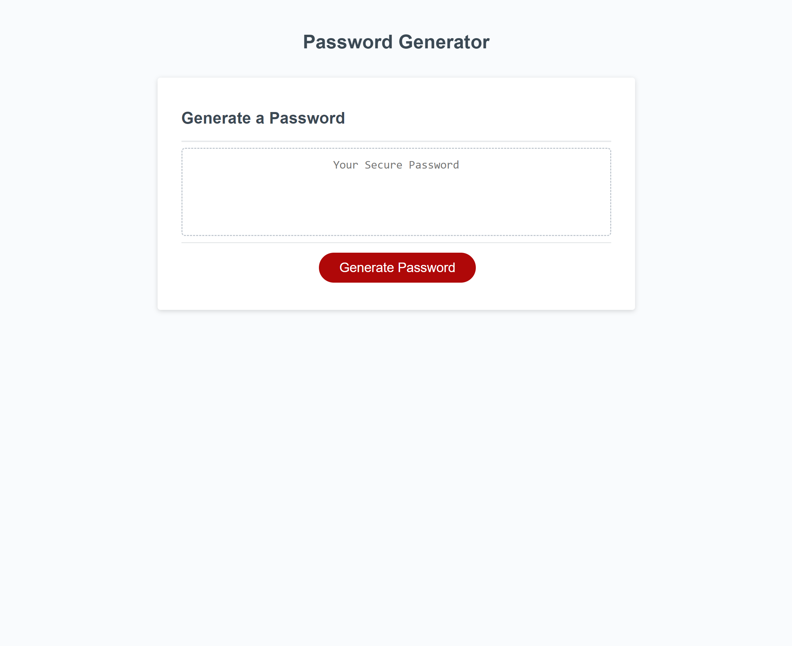

# password-generator-w3

## Description

For this project, I was tasked to create a webpage that is able to generates a set of password when the user clicks the button on the page. The passwords that are created with this webpage includes the option of selecting different combinations of numbers, upercase, lowercase, and special characters. 

## Installation

N/A

## Usage

To generate a set of password, click the generate password button. After, you will be prompted with a series of questions that narrows down the password specifications.

### Credits

N/A

#### Website Link
[Click here for live site](https://slmov215.github.io/password-generator-w3/)

#### Contact
[Stephen Mov on GitHub](https://github.com/slmov215/password-generator-w3)
## License

Please refer to the LICENSE in the repo.